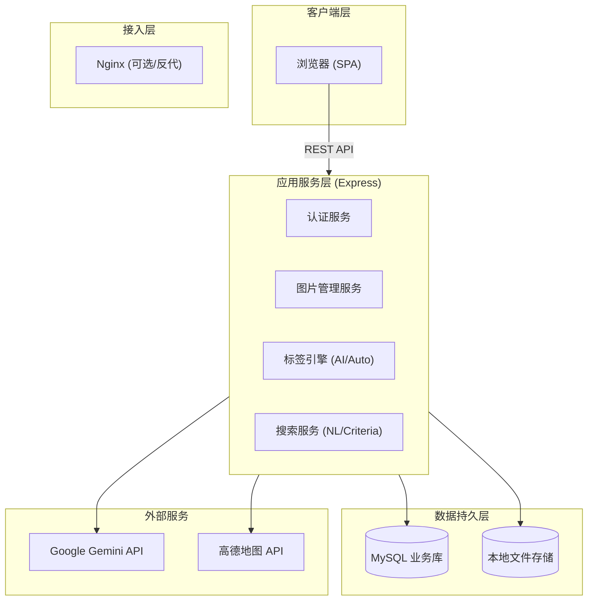
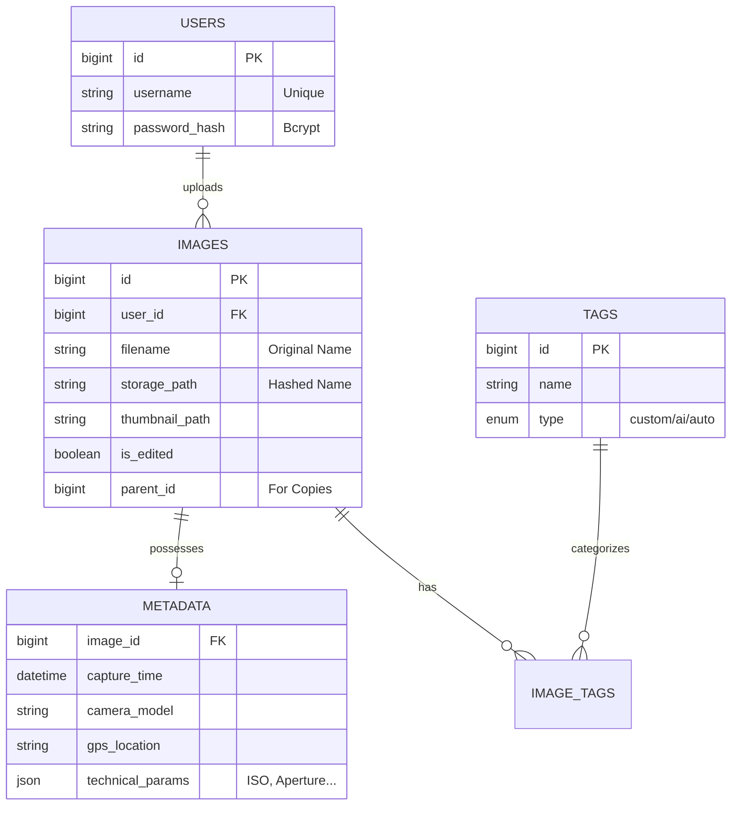
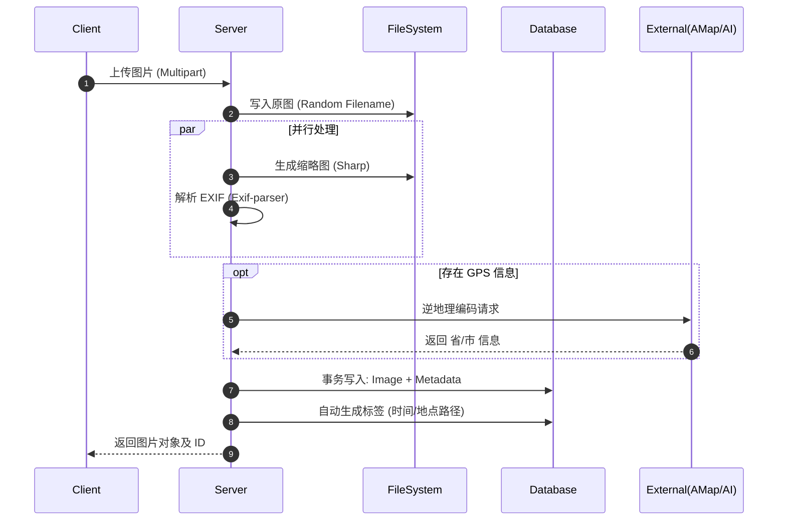

# PicHub - 设计文档

## 引言 (Introduction)

### 文档目的
本文档旨在详细阐述 **PicHub 个人智能图片库系统** 的技术架构、模块设计、数据模型及关键业务流程。本文档作为开发实施的蓝图，确保前后端开发人员对系统实现达成共识，并为后续的部署运维与测试提供依据。

### 产品综述
PicHub 是一个基于 B/S 架构的轻量级图片管理平台。它旨在解决个人图片分散管理难的问题，通过集成 AI 标签生成、自然语言（NL）检索及在线编辑功能，实现图片资源的**高可用存储、智能化检索与便捷化管理**。

---

## 需求分析与范围 (Requirements & Scope)

### 业务背景与痛点
本项目基于“可部署、可演示、可检索、可管理”的核心诉求构建。针对现有开源方案或简易 Demo 中常见的以下问题进行攻关：
*   **数据易失性**：容器重启导致文件或元数据丢失。
*   **检索低效**：仅支持文件名匹配，无法基于语义或场景搜索。
*   **元数据混乱**：EXIF 信息缺失导致管理困难。
*   **交互割裂**：编辑图片需要下载本地处理后再上传。

### 范围界定 (Scope Management)

#### In-Scope (包含内容)
*   **核心管理**：用户认证、图片上传/删除、EXIF 提取、轮播展示。
*   **增强检索**：多条件组合搜索、基于 AI 的自然语言对话式检索。
*   **智能标签**：支持自定义、AI 自动生成、基于时空的规则生成（Auto Tags）。
*   **在线编辑**：裁剪、旋转、调色，并支持**副本另存与标签继承**。
*   **部署交付**：Docker Compose 一键编排，包含数据持久化方案。

#### Out-of-Scope (不包含内容)
*   **分布式存储**：暂不接入 AWS S3 / Aliyun OSS，采用本地 Volume 挂载。
*   **复杂异步流**：暂不引入 RabbitMQ/Kafka 做异步任务解耦（AI 采用同步调用+超时控制）。
*   **MCP 协议**：暂不提供完整的 MCP Server 实现，仅通过 REST API 承载对话能力。

### 验收标准 (Success Metrics)
*   **交付物完整性**：`docker compose --profile prod up -d` 即可启动完整服务。
*   **数据持久性**：容器销毁重建后，MySQL 数据与磁盘文件不丢失。
*   **质量保障**：后端单元测试（Jest）覆盖核心 Service 层；前端 Build 无报错。

---

## 技术选型与架构决策 (Tech Stack & Decisions)

### 技术栈概览

| 领域 | 技术选型 | 选型理由 (Decision Drivers) |
| :--- | :--- | :--- |
| **前端** | Vue 3 + Vite + Pinia | 响应式性能好，Pinia 状态管理简洁，Vite 构建速度快。 |
| **UI 框架** | Element Plus + Tailwind | Element 提供成熟组件，Tailwind 灵活处理布局细节。 |
| **后端** | Node.js (Express 5.x) | 生态丰富，异步 I/O 适合处理高并发的文件上传请求。 |
| **数据库** | MySQL (Sequelize ORM) | 关系型数据强一致性；ORM 屏蔽数据库差异（方便切换 SQLite 测试）。 |
| **图像处理** | Sharp + Exif-parser | Sharp 性能远超 Jimp，适合实时缩略图生成；Exif-parser 解析稳定。 |
| **AI 服务** | Google Gemini | 具备多模态理解能力，用于图片打标与 NL 语义解析。 |

### 关键架构权衡 (Trade-offs)

1.  **存储方案：本地 Volume vs 对象存储**
    *   *决策*：选择本地 Volume。
    *   *理由*：降低部署门槛，便于验收演示，无需配置云厂商 AK/SK。
    *   *代价*：不支持横向扩展（Scale-out），单机磁盘存在瓶颈。

2.  **搜索实现：SQL Like vs Elasticsearch**
    *   *决策*：基于 SQL 的条件查询 + AI 解析。
    *   *理由*：数据量级在万级以下，MySQL 足以支撑；引入 ES 会极大地增加系统资源开销（RAM）。
    *   *代价*：全文检索能力较弱，依赖 AI 将自然语言转译为结构化条件。

3.  **标签体系设计：三分法**
    *   *决策*：将 `custom` / `ai` / `auto` 标签统一存储，通过 `tag_type` 区分。
    *   *理由*：简化查询逻辑，便于统一搜索。
    *   *代价*：前端展示层需要做额外的分类渲染逻辑。

---

## 总体架构设计 (System Architecture)

### 逻辑架构图
采用经典的分层架构，实现关注点分离。



---

## 详细设计 (Detailed Design)

### 数据库模型设计 (Schema Design)

关键实体关系定义如下：



**设计亮点：**
*   **读写分离优化**：将高频读取的图片基础信息（`IMAGES`）与低频读取的详细元数据（`METADATA`）分表存储。
*   **标签去重**：`TAGS` 表作为独立字典表，避免大量重复字符串存储。

### 核心业务流程 (Key Processes)

#### (1) 智能上传与自动归档流程
该流程包含文件处理、元数据解析、AI/规则打标三个并行或串行任务。



#### (2) 自然语言搜索 (NL Search) 流程
采用 **LLM Agent** 模式，将自然语言转化为 SQL 查询条件。

1.  用户输入：“找一下去年在杭州拍的猫”
2.  Server 调用 Gemini，Prompt 包含当前支持的字段 schema。
3.  Gemini 返回 JSON：
    ```json
    {
      "tags": ["猫"],
      "date_range": {"start": "2024-01-01", "end": "2024-12-31"},
      "location": "杭州"
    }
    ```
4.  Server 将 JSON 映射为 Sequelize 的 `Where` 查询条件。
5.  执行查询并返回结果。

---

## 接口设计规范 (API Specification)

遵循 RESTful 风格，所有接口挂载于 `/api/v1` 下。详细定义见 Swagger/OpenAPI 文档。

### 通用规范
*   **认证**：Header 携带 `Authorization: Bearer <token>`
*   **响应结构**：
    ```json
    {
      "success": true,
      "data": { ... },
      "message": "Operation successful",
      "errorCode": null
    }
    ```
*   **错误码**：
    *   `400`：参数校验失败
    *   `401`：Token 过期或无效
    *   `403`：权限不足（试图操作他人的图片）
    *   `429`：请求过于频繁（针对 AI 接口）

### 核心接口摘要
*   `POST /images/upload`：支持 `form-data`，字段 `file`。
*   `POST /images/{id}/edit`：提交编辑后的图片，保存为副本。
*   `POST /search/nl`：Body `{ query: "自然语言" }`，设置 15s 超时。

---

## 非功能性设计 (Non-Functional Requirements)

### 安全性 (Security)
*   **存储安全**：上传文件名随机化（UUID），防止路径遍历攻击；禁止上传可执行文件后缀。
*   **密码安全**：使用 `bcrypt` 加盐哈希，并在传输层建议使用 HTTPS。
*   **资源隔离**：所有 SQL 查询强制注入 `where user_id = ?`，防止越权访问。

### 性能与可靠性 (Performance & Reliability)
*   **图片加载**：列表页强制使用 `thumbnail_small`，详情页使用 `thumbnail_medium`，点击查看原图才加载原始文件。
*   **超时熔断**：外部 API（Gemini/AMap）设置严格超时时间（如 10s），超时后降级为“服务暂不可用”提示，不阻塞主流程。

### 可维护性 (Maintainability)
*   **配置管理**：所有敏感信息（DB 密码、API Key）通过环境变量（`.env`）注入，禁止硬编码。
*   **日志记录**：使用 `morgan` 记录 HTTP 请求日志，关键业务逻辑增加 Error Log。

---

## 部署与测试 (Deployment & Testing)

### 部署架构
基于 Docker Compose 的微服务编排：
*   **App Service**: 暴露 3000 端口，挂载 `./uploads` 至 `/app/uploads`。
*   **DB Service**: MySQL 8.0，挂载 `./mysql-data` 至 `/var/lib/mysql`。

### 测试策略
*   **单元测试**：针对 `autoTags.js`, `searchService.js` 等纯逻辑模块。
*   **集成测试**：使用 Supertest 模拟 HTTP 请求，覆盖完整的“注册-登录-上传-搜索”链路。
*   **人工验收**：重点验证 AI 搜索的语义理解准确性及 UI 的加载状态反馈。

---

## 风险与缓解计划 (Risk Management)

| 风险点 | 影响 | 缓解措施 |
| :--- | :--- | :--- |
| **外部 API 不可用** | AI 标签/搜索功能失效 | 前端展示特定错误 Toast；系统回退至仅支持基础关键字搜索。 |
| **磁盘空间不足** | 无法上传新图 | 设置文件大小限制（如 20MB）；提供定期清理脚本。 |
| **元数据解析失败** | 无法获取拍摄时间/地点 | 设置默认值（如上传时间）；允许用户手动补全信息。 |
