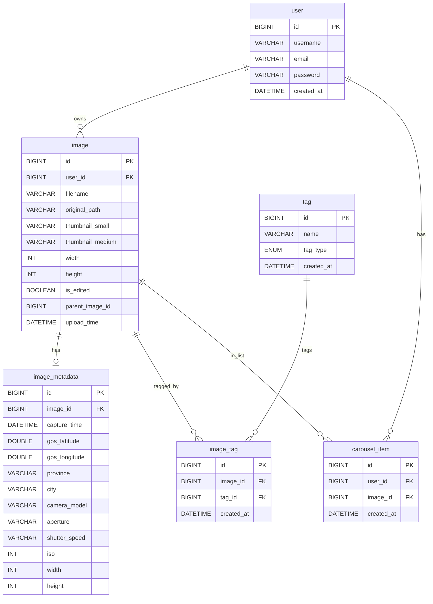
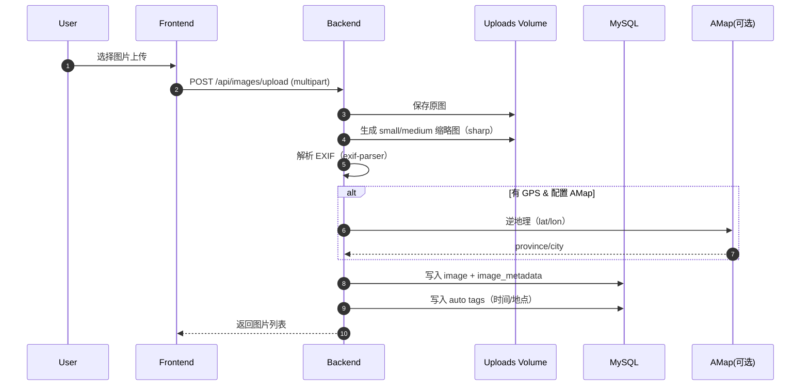
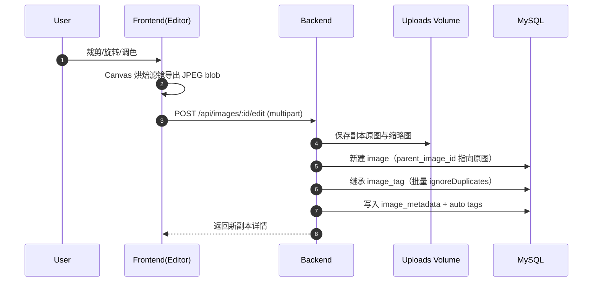
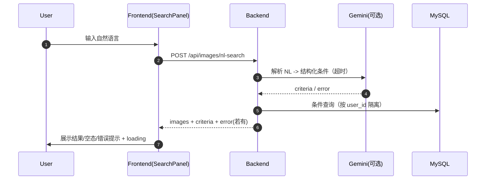

# PicHub 图片管理网站 - 项目设计文档

## 0. 摘要（Summary）
PicHub 是一个面向个人图片库管理的 B/S 网站，支持用户注册登录、图片上传与缩略图生成、EXIF 元信息提取、标签（自定义/AI/自动）管理、多条件搜索与自然语言搜索、轮播展示、在线编辑（裁剪/调色）以及删除等功能。

本文的目的：
- 用文字把“问题是什么、方案是什么、为什么这么选（取舍）”讲清楚，便于验收与复现
- 让读者能快速定位到代码模块与数据结构，并理解关键业务链路

---

## 1. 背景与问题定义
课程要求的核心是：**可部署、可演示、可检索、可管理** 的图片管理网站，并包含 AI 与“对话式检索”的增强能力。实际开发中遇到的关键问题：
- 图片文件与数据库元信息需要同时持久化（容器重启不丢）
- EXIF 信息不稳定（不同设备字段差异大），需要“尽力提取 + 允许为空”
- AI/NL 搜索受网络与模型响应影响，需要明确的超时与 UI 等待提示
- 标签体系需要兼容“用户自定义 / AI 生成 / 系统自动生成”，且编辑副本要继承标签避免信息丢失

---

## 2. 目标、非目标与成功标准

### 2.1 目标（Goals）
- 覆盖课程 11 个基础功能 + 2 个增强功能，并能在 Docker Compose 下稳定演示
- 搜索可用：条件搜索 + NL 搜索；结果为 0 时给出明显空态与当前生效筛选条件
- 编辑可用：裁剪 + 调色导出为新副本，并继承原图标签；副本命名不冲突
- 移动端可用：核心流程（上传/搜索/详情/轮播/编辑/删除）在手机浏览器可完成

### 2.2 非目标（Non-goals）
- 不做云对象存储（S3/OSS）与 CDN（本项目采用本地 volume 存储）
- 不做分布式任务队列/异步工作流（AI 调用与处理为同步请求，配合超时与提示）
- 不提供完整 MCP 协议 Server（当前用 REST NL 搜索承载“对话检索”能力）

### 2.3 成功标准（Success Criteria）
- 从零启动：`docker compose --profile prod up -d --build` 后可注册登录并完成全流程演示
- 数据持久化：容器重启后图片与数据库记录仍在（通过 Docker volume）
- 后端测试可通过：`cd backend && npm test`
- 前端可构建：`cd frontend && npm run build`

---

## 3. 技术选型与取舍（Tradeoffs）

### 3.1 技术栈
**前端**
- Vue 3 + Vite + Vue Router
- Pinia（`frontend/src/stores/auth.js`）
- Element Plus + Tailwind CSS
- CropperJS：裁剪交互（`frontend/src/views/Editor.vue`）

**后端**
- Node.js（ESM）+ Express（当前依赖为 5.x）
- Sequelize ORM（生产连接 MySQL；测试使用 SQLite）
- JWT + bcrypt：认证与密码存储
- multer + sharp：上传与缩略图生成
- exif-parser：EXIF 解析
- swagger-ui-express：API 文档

**外部服务（可选）**
- Google Gemini：AI 标签生成、NL 解析（慢/不稳定是常态，采用超时与清晰提示）
- AMap：GPS 逆地理（严格使用 `city` 字段，生成路径式地点标签）

### 3.2 关键取舍
- 图片存储采用本地 volume：实现最简、易验收；缺点是不利于横向扩展
- 标签三分法：`custom/ai/auto` 统一入表，降低查询复杂度；缺点是需要在 UI 做清晰区分
- NL 搜索走“解析 → 条件搜索”：保证可解释性与可复用；缺点是召回/精度受 prompt 与标签覆盖影响
- 不实现 MCP 协议层：优先保证课程演示的“对话检索”能力链路可用（REST），避免协议栈引入不确定性

---

## 4. 总体架构

### 4.1 模块与数据流

```mermaid
graph TB
  subgraph FE["前端（Vue SPA）"]
    FE1[Auth]
    FE2[Gallery/Detail]
    FE3[Search (criteria + NL)]
    FE4[Editor]
    FE5[Carousel UI]
  end

  subgraph BE["后端（Express）"]
    BE1[Routes]
    BE2[Controllers]
    BE3[Services]
    BE4[(Sequelize Models)]
  end

  subgraph PERSIST["持久化"]
    DB[(MySQL)]
    FS[(Uploads Volume)]
  end

  FE -->|REST + JWT| BE1
  BE1 --> BE2 --> BE3 --> BE4 --> DB
  BE3 --> FS
```

### 4.2 “大模型对话检索”能力说明
课程文档提到“提供 mcp 接口，能通过大模型对话方式检索图片”。当前实现以 **REST 自然语言检索接口**承载该能力：
- `POST /api/images/nl-search`：自然语言 → Gemini 解析 → 结构化条件 → 统一搜索链路 → 返回图片列表

说明：
- 本仓库未实现完整 MCP 协议 Server（协议层）。
- 若验收必须展示 MCP 协议，可在此 REST 能力之上做薄封装（不改核心业务逻辑）。

---

## 5. 模块设计（代码对应）

### 5.1 前端
页面（`frontend/src/views/`）：
- `Login.vue` / `Register.vue`
- `Gallery.vue`：图库 + 搜索面板 + 轮播入口
- `ImageDetail.vue`：详情 + 标签编辑 + 元信息侧栏 + 删除
- `Editor.vue`：裁剪/旋转/调色，保存副本

组件（`frontend/src/components/`）：
- `ImageUploader.vue`：上传
- `ImageGrid.vue`：缩略图网格 + 加入轮播按钮
- `ImageCarousel.vue`：轮播展示
- `SearchPanel.vue`：条件搜索 + NL 搜索（含加载中/空态/错误提示）
- `TagEditor.vue`：标签增删 + AI 标签生成（含加载中提示）

### 5.2 后端
路由（`backend/src/routes/`）：
- `auth.js` / `images.js` / `tags.js` / `search.js` / `carousel.js`

控制器（`backend/src/controllers/`）：
- `authController.js` / `imageController.js` / `tagController.js` / `searchController.js` / `carouselController.js`

服务（`backend/src/services/`）：
- `images.js`：保存原图与缩略图、公开 URL、删除文件
- `autoTags.js`：自动标签（时间/地点路径）
- `maps.js`：AMap 逆地理（可选）
- `gemini.js`：Gemini 调用（含超时）
- `tagInheritance.js`：编辑副本继承标签（批量写入）

---

## 6. 数据设计

### 6.1 表结构与关系（概览）
建表脚本：`docker/mysql/init.sql`  
启动自检：`backend/src/db/ensureSchema.js`



### 6.2 标签类型与命名约定
- `custom`：用户手动添加
- `ai`：AI 生成（用户可删除）
- `auto`：系统自动生成（时间/地点）

命名风格：路径式（便于 NL 搜索与人工筛选）
- 时间：`时间/{年}`
- 地点（可选）：`地点/{省}`、`地点/{省}/{地级市}`（严格使用 AMap 的 `city` 字段）

---

## 7. 关键流程（序列图）

### 7.1 上传（缩略图 + EXIF + 自动标签）



### 7.2 编辑保存副本（裁剪 + 调色）



### 7.3 自然语言搜索（NL Search）



---

## 8. 接口设计（API）
OpenAPI 文件：`backend/src/openapi.yaml`（运行后通过 `http://localhost:8080/api-docs` 查看）

接口分组：
- Auth：注册/登录/当前用户
- Images：上传、列表、详情、删除、保存编辑副本
- Tags：图片标签增删、列出标签、生成 AI 标签
- Search：条件搜索、NL 搜索
- Carousel：轮播列表增删查（最多 20 张）

---

## 9. 安全与权限
- 密码：bcrypt 哈希存储（不落明文）
- 鉴权：JWT；所有资源查询/变更必须按 `user_id` 过滤
- 错误响应：避免泄露内部错误细节（需要时仅在开发环境查看日志）
- 上传安全：
  - 使用 multer 接收；对文件类型/大小做限制（以实现为准）
  - 文件落盘使用随机文件名；原始“展示名”保存在 `image.filename`
  - 兼容中文文件名在 multipart 头的历史编码问题（见 `backend/src/controllers/imageController.js`）

---

## 10. 性能与容量考虑
- 缩略图：列表/详情优先使用缩略图减少流量
- 分页：列表接口支持 limit/offset（避免一次加载全量）
- 索引：对常用查询字段建立索引（建表脚本中体现）
- AI/NL：外部调用超时（避免 UI 长时间卡死），并在前端展示 loading

---

## 11. 部署与运行
Docker Compose：`docker-compose.yml`
- 生产模式：`docker compose --profile prod up -d --build`
- 开发模式（代码挂载）：`docker compose --profile dev up -d --build`

持久化：
- `mysql-data`：数据库数据
- `upload-data`：上传图片与缩略图

---

## 12. 测试策略
- 后端：Jest + Supertest（`backend/src/__tests__/`），覆盖 auth/images/tags/search/autoTags
- 前端：构建检查 `npm run build`；关键交互以手工验收为主
- 手工验收脚本：`docs/test-report.md`

---

## 13. 风险与应对
- 外部 API 不可用（Gemini/AMap）：明确错误提示；核心功能仍可运行
- 网络慢：前端 loading + 后端超时，避免“无响应”
- MySQL/SQLite 差异：schema 自检（`backend/src/db/ensureSchema.js`）与测试覆盖

---

## 14. 相关文档入口
- 需求规格说明书：`docs/requirements.md`
- 使用手册：`docs/user-manual.md`
- 测试报告：`docs/test-report.md`
- 开发小结：`docs/dev-summary.md`
