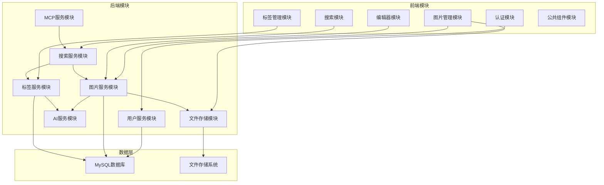

# PicHub 图片管理网站 - 项目设计文档

## 1. 概述

### 1.1 项目简介
PicHub 是一个基于 B/S 架构的智能图片管理系统，支持图片上传、EXIF 信息提取、智能标签、多条件搜索、在线编辑等功能，并通过 MCP 接口支持自然语言交互。

### 1.2 设计目标
- **模块化设计**：高内聚、低耦合的模块划分
- **可扩展性**：便于后续功能扩展
- **高性能**：支持大量图片的快速检索和展示
- **易部署**：Docker 容器化一键部署
- **跨平台**：适配 PC 和移动端

---

## 2. 模块划分设计 ⭐

### 2.1 模块划分原则

#### 原则 1：单一职责原则（SRP）
每个模块只负责一个独立的业务领域，避免模块功能过于复杂。

#### 原则 2：高内聚低耦合
模块内部功能紧密相关，模块之间通过清晰的接口通信。

#### 原则 3：分层设计
前端、后端、数据层清晰分离，支持独立开发和测试。

#### 原则 4：业务导向
按照业务领域划分模块，而非技术层面。

### 2.2 总体模块划分



### 2.3 前端模块详细设计

#### 2.3.1 认证模块（Auth Module）
**职责**：用户注册、登录、Token 管理

**组件划分**：
- `LoginPage`：登录页面
- `RegisterPage`：注册页面
- `AuthContext`：认证状态管理
- `ProtectedRoute`：路由守卫

**数据流**：
```
用户输入 → 表单验证 → API调用 → 存储Token → 跳转主页
```

**与其他模块的交互**：
- 为所有需要认证的模块提供 Token
- 通过 Context 共享用户信息

---

#### 2.3.2 图片管理模块（Image Module）
**职责**：图片上传、展示、详情查看、删除

**组件划分**：
- `ImageUploader`：图片上传组件
  - 支持拖拽上传
  - 显示上传进度
  - 批量上传管理
- `ImageGallery`：图片列表展示
  - 瀑布流布局
  - 懒加载
  - 虚拟滚动优化
- `ImageDetail`：图片详情页
  - 原图查看
  - 元数据展示
  - 左右切换
- `ImageCarousel`：轮播组件
  - 全屏模式
  - 自动播放

**状态管理**：
```javascript
{
  images: [],           // 图片列表
  currentImage: null,   // 当前查看的图片
  uploading: false,     // 上传状态
  uploadProgress: 0     // 上传进度
}
```

**与其他模块的交互**：
- 调用标签模块添加/显示标签
- 调用编辑器模块编辑图片
- 调用搜索模块过滤图片

---

#### 2.3.3 标签管理模块（Tag Module）
**职责**：标签的添加、删除、展示

**组件划分**：
- `TagSelector`：标签选择器
  - 下拉选择已有标签
  - 输入创建新标签
- `TagList`：标签列表展示
  - 显示图片的所有标签
  - 支持删除操作
- `AITagButton`：AI 标签生成按钮
  - 触发 AI 分析
  - 显示生成进度

**数据流**：
```
选择/输入标签 → 验证标签 → API调用 → 更新图片标签列表
```

**设计亮点**：
- 标签自动补全（基于历史标签）
- 区分自定义标签和 AI 标签（不同颜色）

---

#### 2.3.4 搜索模块（Search Module）
**职责**：多条件搜索、自然语言搜索

**组件划分**：
- `SearchBar`：简单搜索框
  - 支持自然语言输入
  - 搜索历史提示
- `AdvancedFilter`：高级筛选器
  - 时间范围选择
  - 标签多选
  - 地点、分辨率筛选
- `SearchResults`：搜索结果展示
  - 高亮匹配关键词
  - 显示匹配度

**状态管理**：
```javascript
{
  filters: {
    timeRange: null,
    tags: [],
    location: '',
    resolution: null
  },
  naturalQuery: '',
  results: []
}
```

**与其他模块的交互**：
- 将搜索结果传递给图片管理模块展示
- 调用后端搜索服务和 AI 服务

---

#### 2.3.5 编辑器模块（Editor Module）
**职责**：图片裁剪、旋转、调色

**组件划分**：
- `ImageEditor`：编辑器容器
- `CropTool`：裁剪工具
  - 自由裁剪
  - 固定比例裁剪
- `RotateTool`：旋转工具
- `ColorAdjustTool`：调色工具
  - 亮度、对比度、饱和度滑块
- `HistoryPanel`：历史记录面板
  - 显示操作历史
  - 撤销/重做按钮

**核心设计**：
- 使用 **Canvas API** 进行图片处理
- 采用 **Command 模式** 实现撤销/重做
- 使用 **策略模式** 管理不同编辑工具

**Command 模式实现**：
```javascript
class CropCommand {
  execute(canvas, params) { /* 执行裁剪 */ }
  undo(canvas, prevState) { /* 恢复 */ }
}

class HistoryManager {
  commands = [];
  currentIndex = -1;
  
  execute(command) {
    this.commands.push(command);
    command.execute();
  }
  
  undo() { /* ... */ }
  redo() { /* ... */ }
}
```

---

#### 2.3.6 公共组件模块（Common Module）
**职责**：提供可复用的 UI 组件

**组件划分**：
- `LoadingSpinner`：加载动画
- `ErrorBoundary`：错误边界
- `ConfirmDialog`：确认对话框
- `Toast`：消息提示
- `ResponsiveLayout`：响应式布局容器

**设计原则**：
- 组件无状态化（stateless）
- 通过 props 接收配置
- 支持自定义样式

---

### 2.4 后端模块详细设计

#### 2.4.1 用户服务模块（User Service）
**职责**：用户注册、登录、认证、授权

**类设计**：
```
UserController       ← 处理HTTP请求
UserService          ← 业务逻辑
UserRepository       ← 数据访问
JwtTokenProvider     ← Token生成和验证
PasswordEncoder      ← 密码加密
```

**核心功能**：
1. **注册**：
   - 验证用户名、邮箱唯一性
   - 密码 BCrypt 加密（Cost: 10）
   - 保存用户记录
2. **登录**：
   - 验证用户名/邮箱和密码
   - 生成 JWT Token（有效期 7 天）
   - 返回用户信息和 Token
3. **认证拦截**：
   - 使用 Spring Security Filter
   - 从请求头提取 Token
   - 验证 Token 并注入用户信息

**安全设计**：
- 密码加盐哈希（BCrypt）
- Token 签名验证（HS256）
- 登录失败限制（防暴力破解）

---

#### 2.4.2 图片服务模块（Image Service）
**职责**：图片上传、存储、查询、删除、EXIF 提取

**类设计**：
```
ImageController         ← 处理HTTP请求
ImageService            ← 核心业务逻辑
ImageRepository         ← 数据访问
ImageMetadataRepository ← 元数据访问
ExifExtractor           ← EXIF信息提取
ThumbnailGenerator      ← 缩略图生成
GeoCoder                ← GPS转地名
```

**核心流程**：

##### 图片上传流程
```
1. 接收 MultipartFile
2. 验证文件类型和大小
3. 生成唯一文件名（UUID + 原扩展名）
4. 保存原图到文件系统
5. 异步任务：
   a. 生成缩略图（小、中）
   b. 提取 EXIF 信息
   c. GPS 转地名
6. 保存图片记录到数据库
7. 返回图片信息
```

**EXIF 提取设计**：
```java
public class ExifExtractor {
    public ImageMetadata extract(File imageFile) {
        Metadata metadata = ImageMetadataReader.readMetadata(imageFile);
        
        // 提取拍摄时间
        DateTime captureTime = getDateTime(metadata);
        
        // 提取GPS坐标
        GpsDirectory gps = metadata.getFirstDirectoryOfType(GpsDirectory.class);
        Double lat = gps.getGeoLocation().getLatitude();
        Double lon = gps.getGeoLocation().getLongitude();
        
        // 转换为地名
        String location = geoCoder.reverseGeocode(lat, lon);
        
        return new ImageMetadata(captureTime, lat, lon, location);
    }
}
```

**缩略图生成策略**：
```java
@Async
public void generateThumbnails(Long imageId, File originalFile) {
    // 小缩略图：200x200，中心裁剪
    BufferedImage small = Thumbnails.of(originalFile)
        .size(200, 200)
        .crop(Positions.CENTER)
        .asBufferedImage();
    
    // 中缩略图：800x600，保持比例
    BufferedImage medium = Thumbnails.of(originalFile)
        .size(800, 600)
        .keepAspectRatio(true)
        .asBufferedImage();
    
    // 保存缩略图
    saveFile(small, getThumbnailPath(imageId, "small"));
    saveFile(medium, getThumbnailPath(imageId, "medium"));
}
```

**设计亮点**：
- 异步处理（不阻塞上传响应）
- 批量上传事务管理（部分失败不影响成功的）
- 图片软删除（保留删除记录）

---

#### 2.4.3 标签服务模块（Tag Service）
**职责**：标签的创建、查询、关联管理

**类设计**：
```
TagController      ← 处理HTTP请求
TagService         ← 业务逻辑
TagRepository      ← 数据访问
ImageTagRepository ← 图片标签关联
```

**核心功能**：
1. **添加标签**：
   - 检查标签是否存在（不存在则创建）
   - 检查图片是否已有该标签（防重复）
   - 创建图片-标签关联
2. **删除标签**：
   - 仅删除关联关系
   - 标签本身保留（供其他图片使用）
3. **查询标签**：
   - 获取所有标签（分类型）
   - 获取热门标签（使用频率高）

**批量操作优化**：
```java
public void addTagsToImage(Long imageId, List<String> tagNames) {
    // 批量查询已有标签
    List<Tag> existingTags = tagRepository.findByNameIn(tagNames);
    
    // 找出需要创建的新标签
    Set<String> existingNames = existingTags.stream()
        .map(Tag::getName).collect(Collectors.toSet());
    List<String> newTagNames = tagNames.stream()
        .filter(name -> !existingNames.contains(name))
        .collect(Collectors.toList());
    
    // 批量创建新标签
    List<Tag> newTags = newTagNames.stream()
        .map(name -> new Tag(name, TagType.CUSTOM))
        .collect(Collectors.toList());
    tagRepository.saveAll(newTags);
    
    // 合并所有标签
    List<Tag> allTags = new ArrayList<>(existingTags);
    allTags.addAll(newTags);
    
    // 批量创建关联（避免重复）
    List<ImageTag> associations = allTags.stream()
        .map(tag -> new ImageTag(imageId, tag.getId()))
        .collect(Collectors.toList());
    imageTagRepository.saveAll(associations);
}
```

---

#### 2.4.4 搜索服务模块（Search Service）
**职责**：多条件搜索、自然语言查询

**类设计**：
```
SearchController     ← 处理HTTP请求
SearchService        ← 搜索业务逻辑
SearchQueryBuilder   ← 动态查询构建器
NLSearchService      ← 自然语言搜索
```

**动态查询设计**：
```java
public class SearchQueryBuilder {
    public Specification<Image> build(SearchCriteria criteria) {
        return (root, query, cb) -> {
            List<Predicate> predicates = new ArrayList<>();
            
            // 用户隔离
            predicates.add(cb.equal(root.get("userId"), currentUserId));
            
            // 时间范围
            if (criteria.getStartTime() != null) {
                predicates.add(cb.greaterThanOrEqualTo(
                    root.get("uploadTime"), criteria.getStartTime()));
            }
            
            // 标签（通过JOIN）
            if (!criteria.getTags().isEmpty()) {
                Join<Image, ImageTag> tagJoin = root.join("imageTags");
                predicates.add(tagJoin.get("tag").get("name")
                    .in(criteria.getTags()));
            }
            
            // 地点（模糊匹配）
            if (criteria.getLocation() != null) {
                Join<Image, ImageMetadata> metaJoin = root.join("metadata");
                predicates.add(cb.like(
                    metaJoin.get("locationName"), 
                    "%" + criteria.getLocation() + "%"));
            }
            
            return cb.and(predicates.toArray(new Predicate[0]));
        };
    }
}
```

**自然语言搜索流程**：
```
1. 接收自然语言查询："上个月在北京拍的风景照"
2. 调用 Gemini API 解析意图
3. Prompt示例：
   "请将以下查询转换为JSON格式的搜索条件：
    查询：上个月在北京拍的风景照
    
    可用字段：
    - timeRange: {start, end}
    - tags: [标签数组]
    - location: 地点名称
    
    返回JSON："
4. 解析返回的JSON
5. 调用动态查询构建器
6. 执行查询并返回结果
```

**性能优化**：
- 使用索引（时间、地点、标签）
- 分页加载（避免一次性加载大量数据）
- 查询结果缓存（Redis，可选）

---

#### 2.4.5 AI 服务模块（AI Service）
**职责**：调用 AI 模型生成智能标签

**类设计**：
```
AIController        ← 处理HTTP请求
AITagService        ← AI标签生成逻辑
GeminiClient        ← Gemini API客户端
AIPromptBuilder     ← Prompt构建器
```

**核心流程**：
```
1. 接收图片ID
2. 加载图片文件
3. 转换为Base64编码
4. 构建Prompt
5. 调用Gemini Vision API
6. 解析返回的JSON标签
7. 保存AI标签到数据库
8. 返回标签列表
```

**Prompt 设计**：
```java
public class AIPromptBuilder {
    public String buildTagPrompt() {
        return """
            请分析这张图片，从以下维度生成标签（每个维度1-3个标签）：
            
            1. 场景类型（scene）：如风景、室内、城市、自然、海滩、山地等
            2. 主要对象（objects）：如人物、动物、植物、建筑、食物、车辆等
            3. 色彩风格（style）：如黑白、复古、鲜艳、柔和、暗调、亮调等
            
            请严格按照以下JSON格式返回，不要包含其他文字：
            {
              "scene": ["标签1", "标签2"],
              "objects": ["标签1"],
              "style": ["标签1"]
            }
            """;
    }
}
```

**错误处理**：
```java
@Retry(maxAttempts = 3, backoff = @Backoff(delay = 1000))
public List<Tag> generateTags(Long imageId) {
    try {
        // 调用AI API
        String response = geminiClient.analyzeImage(imageFile, prompt);
        
        // 解析返回JSON
        AITagResponse tags = objectMapper.readValue(response, AITagResponse.class);
        
        // 保存标签
        return saveAITags(imageId, tags);
    } catch (Exception e) {
        log.error("AI tag generation failed for image {}", imageId, e);
        throw new AIServiceException("AI标签生成失败，请稍后重试");
    }
}
```

**设计亮点**：
- 异步处理（不阻塞用户操作）
- 失败重试机制（最多3次）
- 降级方案（AI 失败不影响其他功能）

---

#### 2.4.6 MCP 服务模块（MCP Service）
**职责**：提供 MCP 协议接口，支持大模型调用

**MCP 工具定义**：

##### 工具 1：search_images
```json
{
  "name": "search_images",
  "description": "搜索用户的图片库",
  "parameters": {
    "type": "object",
    "properties": {
      "query": {
        "type": "string",
        "description": "自然语言查询或关键词"
      },
      "timeRange": {
        "type": "object",
        "properties": {
          "start": {"type": "string", "format": "date"},
          "end": {"type": "string", "format": "date"}
        }
      },
      "tags": {
        "type": "array",
        "items": {"type": "string"}
      },
      "location": {
        "type": "string"
      }
    }
  }
}
```

##### 工具 2：get_image_details
```json
{
  "name": "get_image_details",
  "description": "获取指定图片的详细信息",
  "parameters": {
    "type": "object",
    "properties": {
      "imageId": {
        "type": "integer",
        "description": "图片ID"
      }
    },
    "required": ["imageId"]
  }
}
```

**实现架构**：
```java
@McpServer
public class PicHubMcpServer {
    
    @McpTool(name = "search_images")
    public SearchResult searchImages(SearchRequest request) {
        // 解析参数
        String query = request.getQuery();
        
        // 如果是自然语言，先转换为结构化查询
        SearchCriteria criteria = query != null ? 
            nlSearchService.parse(query) : 
            SearchCriteria.from(request);
        
        // 执行搜索
        List<Image> images = searchService.search(criteria);
        
        // 返回结果
        return new SearchResult(images.stream()
            .map(this::toMcpImage)
            .collect(Collectors.toList()));
    }
    
    @McpTool(name = "get_image_details")
    public ImageDetail getImageDetails(Long imageId) {
        Image image = imageService.getById(imageId);
        return toDetailedMcpImage(image);
    }
}
```

---

#### 2.4.7 文件存储模块（Storage Service）
**职责**：文件的保存、读取、删除

**类设计**：
```
StorageService       ← 存储服务接口
LocalStorageService  ← 本地文件系统实现
```

**目录结构设计**：
```
/uploads/
  ├── {userId}/
      ├── 2025/
          ├── 01/
              ├── abc123.jpg              (原图)
              ├── thumbnails/
                  ├── abc123_small.jpg    (小缩略图)
                  ├── abc123_medium.jpg   (中缩略图)
```

**核心功能**：
```java
public interface StorageService {
    // 保存文件，返回存储路径
    String save(MultipartFile file, Long userId);
    
    // 读取文件
    Resource load(String path);
    
    // 删除文件（包括缩略图）
    void delete(String path);
    
    // 生成访问URL
    String getUrl(String path);
}
```

**安全设计**：
- 文件名随机化（防止文件名冲突和路径遍历）
- 用户隔离（每个用户独立目录）
- 文件类型验证（MIME Type + 文件头）

---

### 2.5 模块间通信设计

#### 2.5.1 前端模块通信
**方案**：Pinia 状态管理

**全局状态**：
```javascript
// stores/auth.js
export const useAuthStore = defineStore('auth', {
  state: () => ({
    user: null,
    token: null,
    isAuthenticated: false
  })
})

// stores/images.js
export const useImagesStore = defineStore('images', {
  state: () => ({
    list: [],
    currentImage: null,
    loading: false
  })
})

// stores/tags.js
export const useTagsStore = defineStore('tags', {
  state: () => ({
    allTags: [],
    selectedTags: []
  })
})

// stores/search.js
export const useSearchStore = defineStore('search', {
  state: () => ({
    filters: {},
    results: []
  })
})
```

**模块间事件**：
```javascript
// 图片上传成功后，通知图片列表刷新
const imagesStore = useImagesStore()
imagesStore.addImage(newImage)

// 标签添加后，更新图片详情
const currentImage = imagesStore.currentImage
currentImage.tags.push(newTag)

// 搜索后，更新图片列表
const searchStore = useSearchStore()
searchStore.setResults(results)
```

#### 2.5.2 后端模块通信
**方案**：Spring Bean 依赖注入

**调用关系**：
```
ImageService
  ├→ TagService (添加AI标签)
  ├→ AIService (生成AI标签)
  └→ StorageService (保存文件)

SearchService
  ├→ ImageService (查询图片)
  ├→ TagService (查询标签)
  └→ AIService (解析自然语言)

MCPService
  ├→ SearchService (执行搜索)
  └→ ImageService (获取详情)
```

**设计原则**：
- 单向依赖（避免循环依赖）
- 接口隔离（依赖接口而非实现）
- 事件驱动（解耦异步操作）

---

## 3. 系统架构设计

### 3.1 分层架构

```
┌─────────────────────────────────────────┐
│          表示层 (Presentation)          │
│  ┌────────────┬────────────┬─────────┐  │
│  │ React SPA  │ Mobile Web │ MCP API │  │
│  └────────────┴────────────┴─────────┘  │
└─────────────────────────────────────────┘
                    ↓ REST API / MCP
┌─────────────────────────────────────────┐
│           应用层 (Application)          │
│  ┌────────────────────────────────────┐ │
│  │  Controllers (请求处理、参数验证)   │ │
│  └────────────────────────────────────┘ │
└─────────────────────────────────────────┘
                    ↓ Service Call
┌─────────────────────────────────────────┐
│           业务层 (Business)             │
│  ┌──────┬──────┬──────┬──────┬──────┐  │
│  │ User │Image │ Tag  │Search│ AI   │  │
│  │Service│Service│Service│Service│Service│ │
│  └──────┴──────┴──────┴──────┴──────┘  │
└─────────────────────────────────────────┘
                    ↓ Repository
┌─────────────────────────────────────────┐
│         数据访问层 (Data Access)        │
│  ┌────────────┬────────────────────────┐ │
│  │ Sequelize  │ Storage Service        │ │
│  │  Models    │                        │ │
│  └────────────┴────────────────────────┘ │
└─────────────────────────────────────────┘
                    ↓
┌─────────────────────────────────────────┐
│            数据层 (Data)                │
│  ┌──────────────┬─────────────────────┐ │
│  │ MySQL 8.0    │ File System         │ │
│  └──────────────┴─────────────────────┘ │
└─────────────────────────────────────────┘
```

### 3.2 部署架构

```
┌───────────────────────────────────────────────┐
│              Load Balancer (可选)             │
│                 Nginx (80)                    │
└───────────────────────────────────────────────┘
                       ↓
┌───────────────────────────────────────────────┐
│           Frontend Container (Nginx)          │
│      Vue.js 静态资源 + SPA 路由配置           │
│                 Port: 80                      │
└───────────────────────────────────────────────┘
                       ↓ /api/*
┌───────────────────────────────────────────────┐
│         Backend Container (Node.js)           │
│         Express 服务器                        │
│                Port: 8080                     │
│  ┌─────────────────────────────────────────┐  │
│  │ /uploads → Volume Mount                 │  │
│  └─────────────────────────────────────────┘  │
└───────────────────────────────────────────────┘
                       ↓
┌───────────────────────────────────────────────┐
│          Database Container (MySQL)           │
│                Port: 3306                     │
│  ┌─────────────────────────────────────────┐  │
│  │ /var/lib/mysql → Volume Mount           │  │
│  └─────────────────────────────────────────┘  │
└───────────────────────────────────────────────┘

External Services:
┌──────────────┐
│ Gemini API   │ ← AI 图片分析
└──────────────┘
┌──────────────┐
│ 高德地图 API │ ← GPS 转地名
└──────────────┘
```

---

## 4. 技术栈选择

### 4.1 前端技术栈

| 技术 | 版本 | 选择理由 |
|------|------|----------|
| **Vue.js** | 3.x | 渐进式框架、易学易用、性能优秀 |
| **Vue Router** | 4.x | Vue官方路由方案 |
| **Pinia** | 2.x | Vue 3官方状态管理库、类型安全 |
| **Element Plus** | 2.x | 基于Vue 3的企业级UI组件库 |
| **Tailwind CSS** | 3.x | 原子化CSS、快速样式开发 |
| **Axios** | 1.x | HTTP客户端、拦截器支持 |
| **Cropper.js** | 1.x | 图片裁剪库 |
| **Fabric.js** | 5.x | Canvas图形处理库 |
| **VueUse** | 10.x | Vue组合式API工具集 |

**架构模式**：
- **组件化**：可复用的单文件组件（SFC）
- **状态管理**：Pinia（全局状态管理）
- **代码分割**：动态导入懒加载路由
- **CSS方案**：Tailwind（工具类） + Scoped CSS（组件样式隔离）

### 4.2 后端技术栈

| 技术 | 版本 | 选择理由 |
|------|------|----------|
| **Node.js** | 18.x | 高性能异步I/O、生态丰富 |
| **Express** | 4.x | 轻量级Web框架、中间件支持 |
| **Sequelize** | 6.x | 强大的ORM、支持多种数据库 |
| **MySQL2** | 3.x | MySQL驱动、Promise支持 |
| **JWT** | 9.x | 无状态认证 |
| **bcrypt** | 5.x | 密码加密 |
| **Sharp** | 0.33.x | 高性能图片处理库 |
| **exif-parser** | 0.1.x | EXIF信息提取 |
| **multer** | 1.4.x | 文件上传中间件 |
| **Swagger UI Express** | 5.x | 自动生成API文档 |

**架构模式**：
- **分层架构**：Router → Controller → Service → Repository
- **中间件**：Express中间件处理认证、日志等
- **模块化**：ES Modules组织代码
- **异步处理**：async/await处理异步任务

### 4.3 AI 服务

| 服务 | 用途 | 备选方案 |
|------|------|----------|
| **Google Gemini** | 图片分析、自然语言理解 | 通义千问、文心一言 |
| **高德地图 API** | GPS转地名 | 百度地图API |

### 4.4 部署技术栈

| 技术 | 版本 | 用途 |
|------|------|------|
| **Docker** | 最新 | 容器化应用 |
| **Docker Compose** | 最新 | 多容器编排 |
| **Nginx** | 1.25 | 前端静态资源服务、反向代理 |

---

## 5. 部署方案设计

### 5.1 Docker Compose 配置

```yaml
version: '3.8'

services:
  # MySQL 数据库
  mysql:
    image: mysql:8.0
    container_name: pichub-mysql
    environment:
      MYSQL_ROOT_PASSWORD: rootpassword
      MYSQL_DATABASE: pichub
      MYSQL_USER: pichub_user
      MYSQL_PASSWORD: pichub_pass
    ports:
      - "3306:3306"
    volumes:
      - mysql-data:/var/lib/mysql
      - ./docker/mysql/init.sql:/docker-entrypoint-initdb.d/init.sql
    networks:
      - pichub-network
    healthcheck:
      test: ["CMD", "mysqladmin", "ping", "-h", "localhost"]
      interval: 10s
      timeout: 5s
      retries: 5

  # 后端服务
  backend:
    build:
      context: ./backend
      dockerfile: Dockerfile
    container_name: pichub-backend
    environment:
      SPRING_DATASOURCE_URL: jdbc:mysql://mysql:3306/pichub
      SPRING_DATASOURCE_USERNAME: pichub_user
      SPRING_DATASOURCE_PASSWORD: pichub_pass
      GEMINI_API_KEY: ${GEMINI_API_KEY}
      AMAP_API_KEY: ${AMAP_API_KEY}
    ports:
      - "8080:8080"
    volumes:
      - upload-data:/app/uploads
    depends_on:
      mysql:
        condition: service_healthy
    networks:
      - pichub-network

  # 前端服务
  frontend:
    build:
      context: ./frontend
      dockerfile: Dockerfile
    container_name: pichub-frontend
    ports:
      - "80:80"
    depends_on:
      - backend
    networks:
      - pichub-network

volumes:
  mysql-data:
  upload-data:

networks:
  pichub-network:
    driver: bridge
```

### 5.2 后端 Dockerfile

```dockerfile
# 基础镜像
FROM node:18-alpine

WORKDIR /app

# 复制依赖文件
COPY package*.json ./

# 安装依赖
RUN npm ci --only=production

# 复制源代码
COPY . .

# 创建上传目录
RUN mkdir -p /app/uploads

EXPOSE 8080

CMD ["node", "src/server.js"]
```

### 5.3 前端 Dockerfile

```dockerfile
# 构建阶段
FROM node:18-alpine AS build
WORKDIR /app
COPY package*.json ./
RUN npm ci
COPY . .
RUN npm run build

# 运行阶段
FROM nginx:1.25-alpine
COPY --from=build /app/dist /usr/share/nginx/html
COPY nginx.conf /etc/nginx/conf.d/default.conf
EXPOSE 80
CMD ["nginx", "-g", "daemon off;"]
```

### 5.4 Nginx 配置

```nginx
server {
    listen 80;
    server_name localhost;
    root /usr/share/nginx/html;
    index index.html;

    # SPA 路由支持
    location / {
        try_files $uri $uri/ /index.html;
    }

    # API 代理到后端
    location /api/ {
        proxy_pass http://backend:8080/api/;
        proxy_set_header Host $host;
        proxy_set_header X-Real-IP $remote_addr;
        proxy_set_header X-Forwarded-For $proxy_add_x_forwarded_for;
        
        # 文件上传大小限制
        client_max_body_size 100M;
    }

    # 静态文件缓存
    location ~* \.(js|css|png|jpg|jpeg|gif|ico|svg|woff|woff2)$ {
        expires 1y;
        add_header Cache-Control "public, immutable";
    }
}
```

### 5.5 一键启动脚本

```bash
#!/bin/bash
# start.sh

echo "🚀 Starting PicHub..."

# 检查 .env 文件
if [ ! -f .env ]; then
    echo "❌ .env file not found!"
    echo "Please create .env file with:"
    echo "  GEMINI_API_KEY=your_key"
    echo "  AMAP_API_KEY=your_key"
    exit 1
fi

# 加载环境变量
export $(cat .env | xargs)

# 启动服务
docker-compose up -d

# 等待服务启动
echo "⏳ Waiting for services to start..."
sleep 10

# 检查健康状态
echo "🔍 Checking service health..."
docker-compose ps

echo "✅ PicHub is running!"
echo "📱 Frontend: http://localhost"
echo "🔧 Backend: http://localhost:8080"
echo "📖 API Docs: http://localhost:8080/swagger-ui.html"
```

### 5.6 环境配置（.env.example）

```bash
# Gemini API Key
GEMINI_API_KEY=your_gemini_api_key_here

# 高德地图 API Key
AMAP_API_KEY=your_amap_api_key_here

# MySQL 配置（可选，使用默认值）
# MYSQL_ROOT_PASSWORD=rootpassword
# MYSQL_DATABASE=pichub
# MYSQL_USER=pichub_user
# MYSQL_PASSWORD=pichub_pass
```

---

## 6. 测试方案设计

### 6.1 测试策略

```
┌─────────────────────────────────────┐
│        端到端测试 (E2E)             │  ← 完整用户流程
│      Playwright / Cypress           │
└─────────────────────────────────────┘
                  ↑
┌─────────────────────────────────────┐
│        集成测试 (Integration)       │  ← 模块间协作
│     Supertest / Vue Testing Library    │
└─────────────────────────────────────┘
                  ↑
┌─────────────────────────────────────┐
│        单元测试 (Unit)              │  ← 单个函数/组件
│      Jest / Vitest                  │
└─────────────────────────────────────┘
```

### 6.2 前端测试

#### 单元测试（Vitest + Vue Testing Library）
```javascript
// ImageUploader.test.js
import { mount } from '@vue/test-utils'
import ImageUploader from './ImageUploader.vue'

describe('ImageUploader', () => {
  test('应该显示上传按钮', () => {
    const wrapper = mount(ImageUploader)
    expect(wrapper.find('button').text()).toBe('上传图片')
  })
  
  test('应该验证文件类型', async () => {
    const wrapper = mount(ImageUploader)
    const input = wrapper.find('input[type="file"]')
    
    const invalidFile = new File([''], 'test.txt', { type: 'text/plain' })
    await input.setValue([invalidFile])
    
    expect(wrapper.text()).toContain('不支持的文件类型')
  })
})
```

#### 集成测试（测试组件交互）
```javascript
// ImageGallery.integration.test.jsx
describe('ImageGallery Integration', () => {
  test('搜索后应该更新图片列表', async () => {
    render(
      <Provider store={store}>
        <SearchBar />
        <ImageGallery />
      </Provider>
    );
    
    // 输入搜索条件
    const searchInput = screen.getByPlaceholderText('搜索图片');
    fireEvent.change(searchInput, { target: { value: '风景' } });
    fireEvent.click(screen.getByText('搜索'));
    
    // 等待结果更新
    await waitFor(() => {
      expect(screen.getAllByTestId('image-card')).toHaveLength(5);
    });
  });
});
```

### 6.3 后端测试

#### 单元测试（Jest）
```javascript
// imageService.test.js
const imageService = require('../services/imageService')
const imageRepository = require('../repositories/imageRepository')
const storageService = require('../services/storageService')

jest.mock('../repositories/imageRepository')
jest.mock('../services/storageService')

describe('ImageService', () => {
  test('应该成功上传图片', async () => {
    // Given
    const file = {
      originalname: 'test.jpg',
      mimetype: 'image/jpeg',
      buffer: Buffer.from('test data')
    }
    const userId = 1
    
    storageService.save.mockResolvedValue('/uploads/1/2025/12/abc123.jpg')
    imageRepository.create.mockResolvedValue({
      id: 1,
      filename: 'test.jpg',
      userId
    })
    
    // When
    const result = await imageService.upload(file, userId)
    
    // Then
    expect(result).toBeDefined()
    expect(result.filename).toBe('test.jpg')
    expect(imageRepository.create).toHaveBeenCalled()
  })
  
  test('应该拒绝无效的文件类型', async () => {
    // Given
    const file = {
      originalname: 'test.txt',
      mimetype: 'text/plain',
      buffer: Buffer.from('test')
    }
    
    // When & Then
    await expect(imageService.upload(file, 1))
      .rejects.toThrow('不支持的文件类型')
  })
})
```

#### 集成测试（Supertest）
```javascript
const request = require('supertest')
const app = require('../src/app')
const fs = require('fs')

describe('Image API Integration Test', () => {
  let token
  
  beforeAll(async () => {
    // 登录获取token
    const res = await request(app)
      .post('/api/auth/login')
      .send({ username: 'testuser', password: 'password' })
    token = res.body.token
  })
  
  test('应该成功上传并获取图片', async () => {
    // 上传图片
    const uploadRes = await request(app)
      .post('/api/images/upload')
      .set('Authorization', `Bearer ${token}`)
      .attach('file', './test-data/sample.jpg')
      .expect(200)
    
    const imageId = uploadRes.body.id
    
    // 获取图片详情
    const detailRes = await request(app)
      .get(`/api/images/${imageId}`)
      .set('Authorization', `Bearer ${token}`)
      .expect(200)
    
    expect(detailRes.body.filename).toBe('sample.jpg')
    expect(detailRes.body.width).toBeDefined()
  })
  
  afterAll(async () => {
    // 清理测试数据
    await Image.destroy({ where: { userId: 1 } })
  })
})
```

### 6.4 端到端测试（Playwright）

```javascript
// e2e/image-upload.spec.js
const { test, expect } = require('@playwright/test');

test.describe('图片上传流程', () => {
  test('完整上传流程', async ({ page }) => {
    // 1. 登录
    await page.goto('http://localhost/login');
    await page.fill('input[name="username"]', 'testuser');
    await page.fill('input[name="password"]', 'password');
    await page.click('button[type="submit"]');
    
    // 2. 上传图片
    await expect(page).toHaveURL(/\/gallery/);
    await page.click('button:has-text("上传图片")');
    
    const fileInput = page.locator('input[type="file"]');
    await fileInput.setInputFiles('./test-data/sample.jpg');
    
    // 3. 等待上传完成
    await expect(page.locator('.upload-progress')).toBeVisible();
    await expect(page.locator('.upload-success')).toBeVisible({ timeout: 10000 });
    
    // 4. 验证图片出现在列表中
    const imageCard = page.locator('[data-testid="image-card"]').first();
    await expect(imageCard).toBeVisible();
    
    // 5. 添加标签
    await imageCard.click();
    await page.fill('input[placeholder="添加标签"]', '风景');
    await page.press('input[placeholder="添加标签"]', 'Enter');
    
    // 6. 验证标签已添加
    await expect(page.locator('.tag:has-text("风景")')).toBeVisible();
  });
  
  test('AI标签生成', async ({ page }) => {
    // ... 登录和上传图片 ...
    
    // 触发AI分析
    await page.click('button:has-text("生成AI标签")');
    
    // 等待分析完成
    await expect(page.locator('.ai-tag-loading')).toBeVisible();
    await expect(page.locator('.ai-tag')).toHaveCount(3, { timeout: 30000 });
  });
});
```

### 6.5 测试覆盖率目标

| 层次 | 目标覆盖率 | 说明 |
|------|-----------|------|
| 后端单元测试 | ≥ 70% | Service 层和工具类 |
| 后端集成测试 | ≥ 50% | Controller 层和数据访问 |
| 前端单元测试 | ≥ 60% | 组件和工具函数 |
| E2E 测试 | 核心流程 | 注册、登录、上传、搜索、编辑 |

### 6.6 测试执行计划

```bash
# 后端测试
cd backend
npm test                          # 单元测试
npm run test:integration          # 集成测试
npm run test:coverage             # 生成覆盖率报告

# 前端测试
cd frontend
npm test                          # 单元测试
npm run test:coverage             # 覆盖率报告
npm run test:e2e                  # E2E测试

# Docker环境测试
docker-compose -f docker-compose.test.yml up --abort-on-container-exit
```

---

## 7. 附录

### 7.1 数据库表结构 SQL

```sql
-- 用户表
CREATE TABLE user (
    id BIGINT PRIMARY KEY AUTO_INCREMENT,
    username VARCHAR(50) NOT NULL UNIQUE,
    email VARCHAR(100) NOT NULL UNIQUE,
    password VARCHAR(255) NOT NULL,
    created_at DATETIME NOT NULL,
    updated_at DATETIME NOT NULL,
    INDEX idx_username (username),
    INDEX idx_email (email)
) ENGINE=InnoDB DEFAULT CHARSET=utf8mb4;

-- 图片表
CREATE TABLE image (
    id BIGINT PRIMARY KEY AUTO_INCREMENT,
    user_id BIGINT NOT NULL,
    filename VARCHAR(255) NOT NULL,
    original_path VARCHAR(500) NOT NULL,
    thumbnail_small VARCHAR(500),
    thumbnail_medium VARCHAR(500),
    file_size BIGINT NOT NULL,
    mime_type VARCHAR(50) NOT NULL,
    width INT,
    height INT,
    is_edited BOOLEAN DEFAULT FALSE,
    parent_image_id BIGINT,
    upload_time DATETIME NOT NULL,
    created_at DATETIME NOT NULL,
    INDEX idx_user_id (user_id),
    INDEX idx_upload_time (upload_time),
    FOREIGN KEY (user_id) REFERENCES user(id) ON DELETE CASCADE,
    FOREIGN KEY (parent_image_id) REFERENCES image(id) ON DELETE SET NULL
) ENGINE=InnoDB DEFAULT CHARSET=utf8mb4;

-- 图片元数据表
CREATE TABLE image_metadata (
    id BIGINT PRIMARY KEY AUTO_INCREMENT,
    image_id BIGINT NOT NULL UNIQUE,
    capture_time DATETIME,
    gps_latitude DECIMAL(10,8),
    gps_longitude DECIMAL(11,8),
    location_name VARCHAR(255),
    camera_model VARCHAR(100),
    aperture VARCHAR(20),
    shutter_speed VARCHAR(20),
    iso INT,
    INDEX idx_capture_time (capture_time),
    INDEX idx_location_name (location_name),
    FOREIGN KEY (image_id) REFERENCES image(id) ON DELETE CASCADE
) ENGINE=InnoDB DEFAULT CHARSET=utf8mb4;

-- 标签表
CREATE TABLE tag (
    id BIGINT PRIMARY KEY AUTO_INCREMENT,
    name VARCHAR(50) NOT NULL UNIQUE,
    tag_type ENUM('custom', 'ai') NOT NULL,
    created_at DATETIME NOT NULL,
    INDEX idx_name (name)
) ENGINE=InnoDB DEFAULT CHARSET=utf8mb4;

-- 图片标签关联表
CREATE TABLE image_tag (
    id BIGINT PRIMARY KEY AUTO_INCREMENT,
    image_id BIGINT NOT NULL,
    tag_id BIGINT NOT NULL,
    created_at DATETIME NOT NULL,
    UNIQUE KEY uk_image_tag (image_id, tag_id),
    INDEX idx_image_id (image_id),
    INDEX idx_tag_id (tag_id),
    FOREIGN KEY (image_id) REFERENCES image(id) ON DELETE CASCADE,
    FOREIGN KEY (tag_id) REFERENCES tag(id) ON DELETE CASCADE
) ENGINE=InnoDB DEFAULT CHARSET=utf8mb4;
```

### 7.2 关键技术难点与解决方案

| 难点 | 解决方案 |
|------|----------|
| **大图片上传慢** | 前端压缩、分片上传、后台异步处理 |
| **EXIF提取失败** | 异常捕获、记录日志、不阻塞流程 |
| **AI API超时** | 设置超时时间、重试机制、降级方案 |
| **搜索性能差** | 数据库索引、分页查询、查询缓存 |
| **移动端编辑卡顿** | WebGL加速、简化编辑功能 |
| **图片存储占用大** | 定期清理、压缩存储、CDN加速（可选） |

---

**文档审核**

| 版本 | 日期 | 修改内容 | 修改人 |
|------|------|----------|--------|
| v1.0 | 2025-12-29 | 初始版本 | 贺禹勋 |
